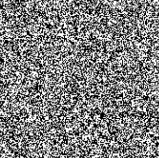
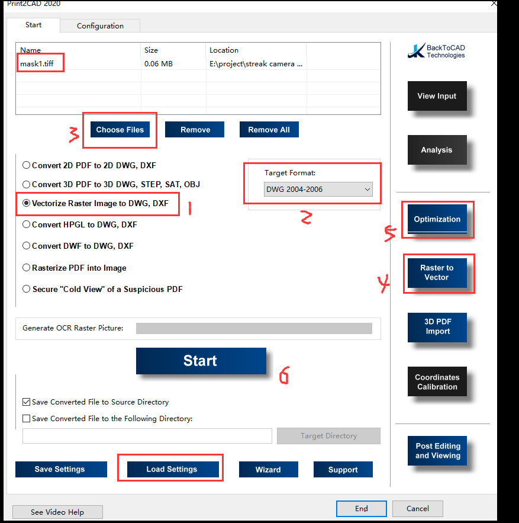
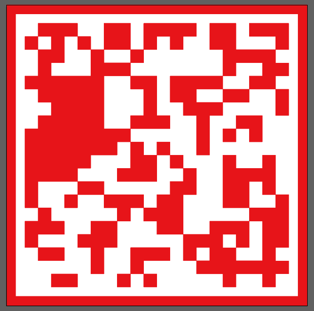

在编码成像等领域中，经常需要加工制作光刻掩膜版，但是厂家一般只负责加工，具体的编码图案需要设计，并把图纸以 CAD 形式提供给加工厂家。这里大概记录了下，如何制作一个随机二值的光刻掩膜 CAD 文件。

## 步骤一：用 MATLAB 生成 mask 图像

- 用 MATLAB 生成 mask 图像并保存为 tif 格式
	- 注意生成时，像素数要比需要的 mask 像素数多几倍（使用 kron 上采样保持形状），比如四倍，这样生成的黑白格是真正的格子，而不是一个点，转换的时候才能转换为一个 CAD 中的格子。
	- 保存为指定 dpi 的图像。（注意根据实际的上采样之后的 dpi 进行设置。比如 mask 是 1000×1000 的，每个像素 25.4um，那么 dpi 是 1000 dpi，但是如果做了 kron 上采样 4 倍，就是相当于尺寸不变，点多四倍，对应的 dpi 应该为 4000dpi

> [参考代码](lithography_mask_gen.m)

## 步骤二：将生成的 mask 图像转换为 CAD 格式

### 方法一：使用 print2cad 软件转换光栅图为矢量图

1. 选择 “ 将光栅图矢量化为 DWG,DXF "
2. 选择具体的 导出格式（根据 AutoCAD 的版本）
3. 选择光栅图文件（tiff 格式的 mask）
4. 设置光栅矢量化模式
5. 设置优化参数
6. start
7. 自动生成变保存，可以点击弹出的“ready， view output files”预览
8. 验证：打开生成的 cad 图纸，查看尺寸、图案等是否符合要求

> [参考配置文件](print2cad_config)（可通过 “load settings" 导入，`corr3.p4c` 转换速度慢一点，但是成功率高一点）

- 注意事项
	- 可参考[官方教程](https://print2cad-2020.backtocad.com/quick-start.html)，根据需求调节矢量化、优化等项目的各种参数，从而得到理想的结果
	- 如果图像较大，生成可能需要较长时间

### 方法二：用 PS+AI，转换到 CAD

> 若 mask 较大，对内存要求高

- 使用 PS 提取 mask 色块路径并保存
	- 打开 PS，”打开“，选择 MATLAB 保存的 tif 格式的 mask
	- “选择”- “颜色范围”- 点击白色的区域，设定参数，确定，得到选区 - 右键，建立工作路径 - 容差 选最小 0.5（如果 MATLAB 生成 mask 时，不进行上采样，其实一个像素就是一个点，不是一个格子，这里就没办法得到直线的工作路径）-
	- 文件 - 导出 - 路径到 illustrator - 保存导出的 .ai 格式图像
- 使用 ai 处理并导出 CAD 格式
	- 用 illustrator 打开上述图像，由于路径是线条，可能直接看看不到内容，所以先 ctrl +A 填充（填充为 CAD 要求的，透光区域的颜色）
	- 窗口 - 打开画板 - 删除无用的画板，仅保留含有 mask 的画板，并设置好合适 尺寸（也可以最后一步再设置）
	- 窗口 - 打开路径查找器面板 - 全选后，形状格式 - 级联（合并）
	- （可选）画 mask 边框 ：选择矩形，然后画一个和 mask 等大，覆盖 mask 的矩形。然后按住 shift+alt，拉动该矩形的一个顶点，使其保持中心不动放大。然后再复制一下当前矩形，同上将新矩形放大。然后，选择新矩形，按住 shift 增选第一个矩形，然后选择路径查找器 - 形状格式 - 差集，得到大矩形减去小矩形得到边框。
	- （可选）窗口 - 打开路径查找器面板 - 全选后，形状格式 - 级联（合并）
	- 如果想让画板和图形边界保存一致，可以选择 对象 - 画板 - 适合图稿边界
	- 导出 - 导出为 选择 CAD 文件格式 （如 dwg）设置相应参数进行保存
- CAD 打开进行确认，并设置尺寸

## 步骤三：确认 CAD 图纸，检测并标注尺寸等信息

- 确定图案是否正确：比较原图像和转换出来的 CAD 图案是否一致
- 确定尺寸是否正确：查看整体尺寸和 mask 的 pixel size 是否与设计相符合，进行必要的尺寸和信息标注
